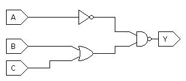

In your groups, answer the following questions.
No need to report the answers to me --
this is just for practice.
We may not get through all of the questions every week.
You may want to take notes during the discussion,
because these questions will be helpful in reviewing for exams.

I will be dropping in and out of rooms to facilitate to the discussions and in
case you have any questions.
Think of it like me walking around the classroom and listening to different
groups.
Again, this isn't meant to be for a grade,
so don't be concerned about giving a wrong answer even if I am in the room.
You can also flag me down in Zoom if you have a question even if I'm not in the
room
(I think the button in Zoom looks like a question mark).

Note: some questions are taken entirely or in part from your textbook.

# General Questions

1. Describe what it means for a circuit to be combinational.

2. It is possible for a truth table to have more than one input and/or more than
one output.
Does the number of entries in the table grow faster with the number of inputs,
with the number of outputs, or the same with both?

3. How many rows are there in a truth table with 6 inputs?

4. Give one possible Boolean expression for the circuit above.

5. Write the truth table for the circuit above.

6. Write the truth table corresponding to `((A xor B) C)'`.

7. Draw the corresponding circuit in the "natural" way.

8. Use your truth table to write the SOP form of the Boolean expression.

9. Use either your truth table or the SOP for you just wrote to draw the
circuit in PLA style.
    * If you don't recall what I mean by PLA style,
    you can review the [relevant slides](/slides/boolean-sop.pdf)
    (fourth-to-last slide)
    or the relevant part of [the video](https://classtranscribe.illinois.edu/video?id=c9fa198b-c181-461b-9c17-2707d45d068d&begin=797&from=sharedlink).

10. For the two circuits above,
determine whether or not each is combinational and explain why or why not.

11. Assume you know that {AND, OR, NOT} is logically complete.
Show that {AND, NOT} is logically complete.
    * First, recall what you need to do to prove a set is logically complete
    given another set that is logically complete.
    * Then, use the second of
    [De Morgan's laws](https://en.wikipedia.org/wiki/De_Morgan%27s_laws#Engineering)
    to help.
